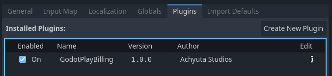
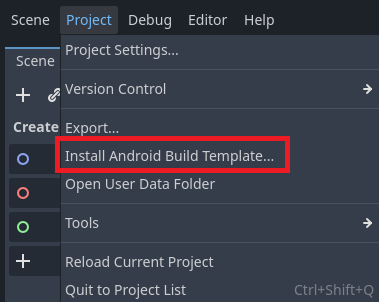
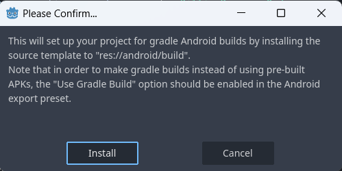

# Installation


## Enable Plugin

After downloading the plugin from AssetLib, it needs to be enabled manually in the Godot editor. Follow these steps to enable the plugin:

1. In the Godot editor, go to `Project > Project Settings`.
2. Navigate to the `Plugins` section.
3. Locate `GodotPlayBilling` and enable it.



**Note**: The plugin includes all necessary `.aar` and `.gdap` files for setup. Developers do not need to separately activate the plugin in the Android export settings.


## Install Android Build Template

If the Android Build Template is already set up, you can skip this step. Otherwise, follow these steps:

1. In Godot Editor, go to `Projects > Install Android Build `Template`.



2. Click `Install` to confirm and set up the Build Template.




## Update Android Manifest

To enable Play Billing permissions, follow these steps:

1. From the project root, navigate to `android` > build`.
2. Locate `AndroidManifest.xml` and open it in your preferred text editor.
3. Add the following line within the <manifest> tag:

```xml
<uses-permission android:name="com.android.vending.BILLING" />

``` 

4. The updated manifest file should look like this:

```xml linenums="1"
<?xml version="1.0" encoding="utf-8"?>
<manifest xmlns:android="http://schemas.android.com/apk/res/android"
    xmlns:tools="http://schemas.android.com/tools"
    android:versionCode="1"
    android:versionName="1.0"
    android:installLocation="auto" >

    <uses-permission android:name="com.android.vending.BILLING" />
    ...

```

