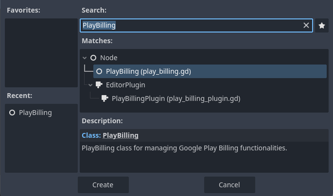
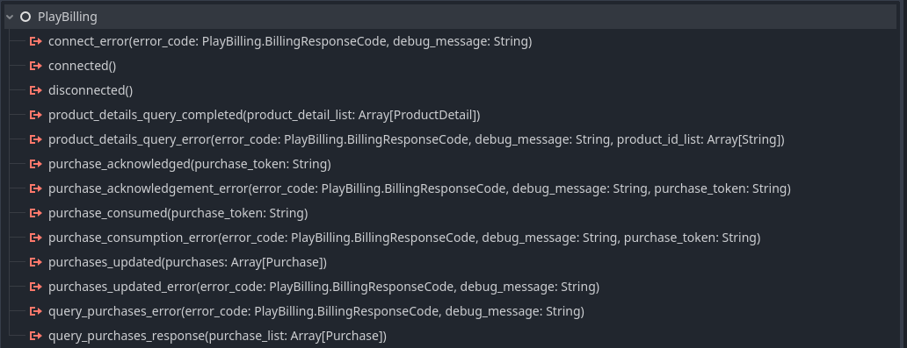

# Integrate Play Billing

Before proceeding with the integration, please ensure that you have completed the following steps:

1. **Set Up Your Google Play Console Account:** Make sure your app is created and configured in the Google Play Console.
2. **Configure In-App Purchase Products:** Set up the required in-app purchase products in the Google Play Console, as these will be necessary for testing and implementing the billing functionality.

## Add PlayBilling Node to your scene

Once the plugin is enabled, the `PlayBilling` node will appear in the Node Hierarchy.



Simply add the `PlayBilling` node to your scene to begin integrating Google Play Billing.


## Initialise

To get started, obtain a reference to the `PlayBilling` node:

```gdscript
@onready var _play_billing: PlayBilling = $PlayBilling
```

Use `start_connection()` to establish a connection to the Play Billing server:

```gdscript
@onready var _play_billing: PlayBilling = $PlayBilling

func _ready():
	_play_billing.start_connection()
```

### Connection Success

Upon a successful connection, the `PlayBilling` node emits a `connected` signal.

After the connection is established, query the product details. **Important:** A product query must be completed successfully before calling `purchase` or `subscribe`; otherwise, they will return an error.

`query_product_details` function accepts two arguments:

1. Array of product IDs.
2. `ProductType` enum.

```gdscript
func _on_play_billing_connected() -> void:
    _play_billing.query_product_details(["product_ids"], PlayBilling.ProductType.INAPP)
```

### Connection Error

Upon failed connection, the `PlayBilling` node emits a `connect_error` signal. Use the `error_code` and `debug_message` for logging.

```gdscript
func _on_play_billing_connect_error(error_code: PlayBilling.BillingResponseCode, debug_message: String) -> void:
	print(error_code, debug_message)
```


## Signals
 
The `PlayBilling` node provides various `Signals` to facilitate the in-app purchase flow.

